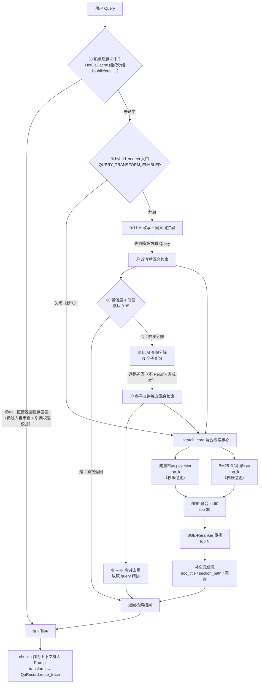

# RAG-Agent 企业级知识库平台

> Django 5 + DRF + Celery + PostgreSQL(pgvector) + Redis + DeepSeek 全栈落地的 RAG 问答系统，以企业级知识库常见能力（审计、运维、权限、质量评估）为设计蓝本，适合研究学习使用。

> **免责声明**：本项目为研究学习用途的示例项目，代码、业务场景与组织架构均为演示设计，不承诺生产环境适用性；请勿直接部署用于生产环境。

> **混合架构（LLM Wiki + GraphRAG + RAG）**：问答检索采用三层路由编排，按置信度逐层降级：
> 1. **LLM Wiki 快速命中**（置信度 ≥ 0.68）：直接返回基于知识节点文档或图谱社区自动生成的 Wiki 页面，延迟最低；
> 2. **GraphRAG**（置信度 ≥ 0.45）：实体/关系局部检索（graphrag_local）+ Louvain 社区摘要全局检索（graphrag_global），回答结构化关系型问题；
> 3. **RAG 兜底**：pgvector 向量 + BM25 + RRF 混合检索 + Rerank 重排，格式化 Top 5 片段作为上下文。
> 每层路由的置信度与耗时记录到 `route_trace`，随问答记录落库，由 RouteAnalysis 持续评估各层命中率与回答质量对比。

---

## 检索流程总览

> 从用户 Query 到最终结果的完整链路，包含**热点缓存**（上游拦截）与**权限过滤**（两路召回内部完成）。查询改写/分解（`QUERY_TRANSFORM_ENABLED`，默认关闭）是透明增强层——仅改变 query，召回/融合/精排完全复用同一核心；LLM 改写或分解**任何失败都降级为原始 Query**，永不阻断主流程。改写/分解的输入输出随 `route_trace` 落库，评估看板据此统计"改写命中率"。



检索核心（`_search_core`，[apps/retrieval/hybrid.py](apps/retrieval/hybrid.py)）五步：**query 向量化 → 向量 + BM25 并行召回 → RRF 融合 → BGE-Reranker 重排 → 元信息补全**，最终返回 `{chunks, stats, raw}`；改写/分解链路见 [apps/retrieval/query_transform.py](apps/retrieval/query_transform.py)。

**缓存（组织分组 + 文档兜底）**：`HotQaCache` 按 `question_hash + root_type + visibility_scope` 三键定位，`visibility_scope` 按答案引用文档的**组织归属**分组（`public` 无引用或全 PUBLIC 文档，任意用户共享 / `org_d3_t7` 部门/团队 ID 升序拼接，同组用户共享），不同权限组各自独立一条、互不覆盖。命中校验两层：① **权限组粗筛**——`org_...` 组需用户可见组织（部门祖先链 + 管辖/所属团队）AND 全覆盖；② **文档级兜底**——`filter_accessible_doc_ids` 对 `cited_doc_ids` 引用文档全通过，兜住黑名单/个人共享/申请审批等组织维度看不见的个人级权限（Deny Override 铁律：任一引用无权则跳过缓存、回落完整检索重新生成，答案文本无法按文档切割部分返回）。旧数据无权限组标记（`cited_doc_ids` 空但有引用）非超管保守跳过。命中结果仍会**过内容审查**（词库更新后拦截历史违规答案）。

**权限过滤**：两路召回（`vector_search` / `bm25_search`）内部均完成检索级权限过滤（黑名单 Deny Override → 可见范围 → 主动共享，见 [apps/retrieval/permission.py](apps/retrieval/permission.py)），RRF 融合与 Rerank 层无需重复判权；Agent 工具在混合检索后还会做二次权限校验。

---

## 一、项目特性

- **三层混合架构（LLM Wiki + GraphRAG + RAG）**：问答按置信度逐层路由——Wiki 页面直接命中 → 图谱实体/关系与社区摘要 → 混合检索兜底，各层命中率与回答质量持续评估对比
- **混合检索 + Rerank**：pgvector 向量检索 + BM25 关键词检索 + RRF 融合 + BGE-Reranker 重排序，二次权限过滤保证安全
- **流式问答**：SSE 流式响应，TTFB/总延迟展示，AbortController 终止，断线自动保存部分回答
- **四层记忆**：short/session/user/global 记忆分层管理，每晚提炼稳定用户偏好
- **文档全生命周期**：多格式解析（PDF/DOCX/Markdown/代码/表格/PPT）→ 语义感知切分 → 数据脱敏 → 向量化 → 版本管理 + 软删除；PDF 深度解析支持 PyMuPDF `find_tables()` 表格提取、跨页合并与图片提取（base64 + OSS 双存储）
- **知识图谱（Graph RAG）**：LLM 实体/关系抽取 + Louvain 社区检测与摘要，图谱增量同步 + 向量检索召回
- **LLM Wiki**：基于知识节点文档或图谱社区摘要自动生成 Wiki 页面，文档变更后增量刷新
- **五层权限模型**：可见范围（TEAM_ONLY/DEPT_ONLY/PUBLIC）+ 主动共享（部门/团队/个人统一表）+ 黑名单（Deny Override 铁律）+ 双审流程 + 权限申请工单双轨制
- **权限缓存分层**：L1~L5 五层缓存（功能权限/部门范围/团队范围/数据等级/资源临时授权）+ 延迟双删防并发脏写
- **审计可追溯**：哈希链防篡改审计日志、权限审计日志（只追加不删）、文档操作日志（15 种 action）、敏感词过滤、IP 黑白名单、登录锁定
- **系统配置工单化**：SystemConfig KV 存储 + LLMModel 模型管理 + 配置/模型变更工单（高风险项超管复核）+ 风险等级分级
- **系统监控**：P50/P95/P99 延迟百分位（预计算 + 直方图）、Celery 队列深度快照、组织使用报表、实时指标（Redis 5 分钟刷新）
- **RAG 质量评估中心**：黄金测试集 + DeepEval 12 维 LLM-as-Judge + 生产对话自动评估（采样 + 分层限速）+ 低分回归测试集 + 低分对话归因分析 + 离线检索评估（Recall@K/MRR/NDCG）+ 文档质量量化 + 知识库覆盖率 + Ragas 部署前评估 + 反馈闭环

---

## 二、快速启动

```bash
cd rag

# 1. 配置环境变量
cp .env.example .env && vim .env

# 2. 一键启动
docker compose up -d --build

# 3. 执行数据库迁移（首次部署）
docker compose exec django python manage.py migrate

# 4. 初始化系统数据（角色、权限、部门、团队、用户）
docker compose exec django python manage.py init_system
```

启动完成后，默认通过 Django 直接对外提供服务（端口 8000）：

| 服务 | 开发/调试地址（直连 Django） | 生产环境地址（经 Nginx 反代） |
|------|------------------------------|-------------------------------|
| Web UI（极简 SPA） | <http://localhost:8000> | <http://your-domain/> |
| API | <http://localhost:8000/api/v1/> | <http://your-domain/api/v1/> |
| Django Admin | <http://localhost:8000/admin/> | <http://your-domain/admin/> |
| Healthz | <http://localhost:8000/healthz> | <http://your-domain/healthz> |

> 说明：上表中带 `:8000` 的地址是直连 Django 容器、不经过 Nginx，仅用于本地开发与调试；生产环境应通过 Nginx 反向代理统一对外暴露（默认 80/443），不要在对外地址中保留 `:8000` 端口。

---

## 三、目录结构

```
rag/
├── apps/
│   ├── users/                  # 用户系统（User + RBAC 权限 + 部门/团队 + 文档级权限 + 审批工单）
│   │   ├── models.py           # User/Department/Team/Role/Permission + Scope 关联表 + TicketList 统一工单体系（明细表 4 张）+ RoleConflictRule/PermissionAuditLog
│   │   ├── signals.py          # 部门/团队变更 → 自动同步 KnowledgeNode 树 + 缓存失效
│   │   ├── views.py            # 部门/团队 CRUD（含删除保护：有成员/有文档→禁止删除）
│   │   ├── perm_cache.py       # RBAC 权限分层缓存 L1~L5 + 延迟双删（super_admin 不走缓存）
│   │   ├── audit_service.py    # 统一权限审计日志写入服务（只 INSERT 不删，失败不阻断主业务）
│   │   ├── ticket_service.py   # 权限配置审批工单服务（共享审批池 + 顺序执行 + 状态机）
│   │   ├── permissions.py      # DRF 自定义权限类
│   │   └── management/commands/ # grant_superadmin / seed_permissions 管理命令
│   ├── knowledge/              # 知识节点 + 文档 + 切片 + 多格式解析器 + 资源共享
│   │   ├── models.py           # KnowledgeNode(固定4层树) + Document(版本管理+软删除) + DocumentChunk + CodeChunk + ImageResource + DocOperationLog + ResourceShare + ResourceBlockList
│   │   ├── access.py           # resolve_doc_access() — 7 步优先级权限判定（支持多团队）
│   │   ├── node_sync.py        # 部门/团队 ↔ KnowledgeNode 双向同步 + 子树文档计数
│   │   ├── chunker.py          # 语义感知切片（按段落聚合 + 表格双层存储 + section_path 溯源）
│   │   ├── desensitizer.py     # 数据脱敏（手机号/身份证/邮箱/银行卡入库前脱敏）
│   │   ├── parsers/            # pdf / docx / markdown / code / spreadsheet / presentation / config 七套解析器
│   │   │   └── pdf_parser.py   # PyMuPDF find_tables() 表格提取 + 跨页合并 + 图片 base64
│   │   ├── storage.py          # 文档存储抽象层（local/OSS，按节点路径存储）
│   │   └── tasks.py            # Celery 任务（解析、向量化、批量导入、图片保存）
│   ├── retrieval/              # pgvector 向量检索 + BM25 关键词 + 混合检索（RRF 融合）+ Rerank
│   │   ├── models.py           # DocumentVector（pgvector HNSW 索引 + 权限冗余字段）
│   │   ├── vector_store.py     # 向量检索封装（cosine 距离 + hnsw.ef_search 会话级调节）
│   │   ├── bm25.py             # BM25 关键词检索（jieba 分词 + keyword_weight 加权）
│   │   ├── permission.py       # build_permission_q() — 检索级权限过滤（黑/白名单）
│   │   ├── hybrid.py           # 混合检索 + 图片 base64 注入 chunk.extra
│   │   └── rerank.py           # BGE-Reranker 重排序
│   ├── llm/                    # DeepSeek Provider + 抽象工厂 + Prompt 模板
│   ├── memory/                 # 四层记忆（short/session/user/global），每晚提炼用户偏好
│   ├── agent/                  # 问答编排 + 任务拆分 + 流式回答 + 引用合并
│   │   ├── executor.py         # 问答执行器（mode: auto/rag/agent/wiki/graphrag）
│   │   ├── task_splitter.py    # 复杂任务拆分
│   │   ├── streamer.py         # SSE 流式输出
│   │   └── tools/              # Agent 工具（知识检索/图谱/Wiki/联网/Text2SQL/计算器）
│   ├── chat/                   # 会话 / QA 记录（含 TTFB/Token 速率/错误类型） / 反馈 / 热点缓存
│   ├── audit/                  # 审计日志（sha256 哈希链防篡改）
│   ├── security/               # 验证码 / IP 黑白名单 / 登录失败锁定 / 敏感词
│   ├── analytics/              # 关键词权重 / 准确率日报 / 趋势统计 / 系统监控 / RAG 质量评估
│   │   ├── models.py           # 16 个模型：关键词权重/日报/系统指标/组织报表/队列深度 + 9 个质量评估模型 + LowScoreAnalysis + RouteAnalysis（三层路由评估）
│   │   ├── deepeval_metrics.py # DeepEval 12 维 LLM-as-Judge 评估（检索1+答案6+安全2+业务3）
│   │   ├── production_eval.py  # 生产对话自动评估（采样率 + 分层限速 + 日预算四重保护）
│   │   ├── regression_eval.py  # 低分回归测试集（沉淀 + 全链路评估 + pass_count 淘汰）
│   │   ├── low_score_analyzer.py # 低分对话归因分析（规则归因为主 + LLM 个性化建议兜底）
│   │   ├── ragas_pipeline.py   # Ragas 部署前评估流水线（零标注 + 自动合成测试集）
│   │   ├── offline_eval.py     # 黄金测试集 + 离线检索评估（Recall@K/MRR/NDCG + 各阶段增益）
│   │   ├── doc_quality.py      # 文档入库质量量化（解析/切分/向量化质量 + 综合评分 0-100）
│   │   ├── coverage.py         # 知识库覆盖率 + 反馈闭环自动化（差评自动关联 chunk）
│   │   ├── realtime.py         # Redis 实时指标（5 分钟刷新，独立 DB 避免干扰）
│   │   ├── tasks.py            # Celery 任务（指标聚合/评估/清理/沉淀/回归）
│   │   ├── views.py            # 监控 + 质量评估 + 评估看板 + 归因分析全套接口
│   │   └── management/commands/ragas_eval.py  # Ragas 评估管理命令
│   ├── notification/           # 邮件订阅 / 发送日志
│   ├── system/                 # 系统配置 / 模型管理 / 变更工单 / Celery 任务日志 / LLM 调用日志
│   │   ├── models.py           # SystemConfig + LLMModel + CeleryTaskLog + LlmCallLog + DataExportLog（工单模型已统一迁移至 users.TicketList）
│   │   ├── config_loader.py    # 配置加载器（优先 DB，回退 .env）
│   │   ├── middleware.py       # 系统级中间件
│   │   ├── views.py            # 配置/模型/工单/健康检查接口
│   │   ├── scheduler_registry.py # 定时任务注册表（任务清单 + 默认 cron + 中文解释 + 调度工单摘要）
│   │   ├── schedulers.py       # SystemConfigScheduler（运行期从 SystemConfig 热更新 Beat 调度）
│   │   └── management/commands/
│   │       ├── init_system.py  # 初始化系统数据入口（角色/权限/配置默认值，组装 init/ 各模块）
│   │       └── init/           # 初始化数据模块（roles / permissions / role_permissions / departments / teams / users / global_memories / system_configs / common + initial_data.yaml）
│   ├── graph/                  # 知识图谱（实体抽取/关系/社区检测/向量检索，Graph RAG）
│   │   ├── models.py           # GraphEntity + GraphRelation + GraphCommunity（Louvain 社区 + 摘要）
│   │   ├── extractor.py        # LLM 实体/关系抽取与去重合并
│   │   ├── community.py        # 社区检测与社区摘要生成
│   │   ├── sync.py             # 文档变更 → 图谱增量同步
│   │   ├── retriever.py        # 图谱检索（实体向量匹配 + 社区摘要召回）
│   │   ├── router.py           # 三层路由编排（Wiki → GraphRAG → RAG 兜底）
│   │   ├── vector_search.py    # 图谱实体向量检索
│   │   ├── embedding.py        # 实体/关系 embedding 生成
│   │   └── tasks.py            # Celery 任务（每日社区检测 + 摘要）
│   └── wiki/                   # LLM Wiki（基于知识节点文档或图谱社区自动生成 Wiki 页面）
│       ├── models.py           # WikiPage + WikiSection + WikiLink（自动链接）
│       ├── generator.py        # LLM 生成 Wiki 页面
│       ├── sync.py             # 文档/社区变更 → Wiki 增量更新
│       ├── retriever.py        # Wiki 页面检索
│       └── tasks.py            # Celery 任务（每日刷新过期 Wiki 页面）
├── rag_project/                # Django 项目配置、根 URL、Celery、ASGI/WSGI
│   ├── settings.py             # 主配置（数据库/缓存/队列/中间件/模型）
│   ├── urls.py                 # 根路由（含前端静态页面路由 + 开发环境 coverage 报告路由）
│   ├── celery.py               # 5 队列 + 18 个 Beat 定时任务（调度默认值来自 scheduler_registry）
│   ├── config.py               # 环境配置辅助（.env 加载 / 敏感凭证读取）
│   ├── test_runner.py          # 自定义测试运行器
│   ├── pagination.py           # 统一分页类
│   ├── asgi.py / wsgi.py       # ASGI/WSGI 入口
│   └── test_settings.py        # 测试专用配置
├── static/                     # 前端静态资源（开发源码）
│   ├── css/                    # 公共 common.css + layout.css + 各页面 page.css
│   ├── fonts/                  # 字体文件（验证码使用 DejaVuSans-Bold.ttf）
│   ├── js/                     # 通用能力 + 各页面模块
│   │   ├── common.js           # 通用工具（DOM/状态/toast/escapeHtml/formatDate/PAGE_MAP/goto）
│   │   ├── api.js              # 统一 API 请求服务（token 管理 / 自动刷新 / SSE 流式）
│   │   ├── layout.js           # 应用壳布局（顶栏/侧栏/全局搜索/用户菜单/登出/通知/角色判断）
│   │   ├── multi-select.js     # 多选下拉组件（搜索 + 全选 + 部门→团队联动）
│   │   ├── chat.js             # 会话问答（流式 + AbortController + TTFB 展示）
│   │   ├── upload.js           # 文档上传（版本管理 + 三选项对话框 + 历史轮询）
│   │   ├── preview-doc.js      # 文档原文预览（分页 + 高亮）
│   │   ├── ticket-center.js    # 工单中心
│   │   ├── index.js            # 首页看板
│   │   ├── graph.js            # 知识图谱可视化页
│   │   ├── wiki.js             # Wiki 页面浏览页
│   │   ├── login.js            # 登录（含验证码）
│   │   ├── profile.js          # 个人资料
│   │   ├── reset-password.js   # 修改密码
│   │   ├── admin.js            # 管理后台通用逻辑
│   │   ├── admin-users.js      # 用户管理
│   │   ├── admin-org.js        # 组织架构管理（部门/团队）
│   │   ├── admin-rbac.js       # 角色权限管理
│   │   ├── admin-nodes.js      # 知识节点管理（动态加载根类型）
│   │   ├── admin-docs.js       # 文档审核（待审列表 + 通过/驳回）
│   │   ├── ticket.js           # 工单中心（四视角：待我审批/我已审批/我的工单/全部工单）
│   │   ├── admin-analytics.js  # 统计分析
│   │   ├── admin-eval.js       # 质量评估中心（黄金集/检索/回答/文档/覆盖率/反馈/归因）
│   │   ├── admin-system-config.js # 系统配置（KV 配置 + 模型管理 + 工单审批）
│   │   ├── admin-scheduler.js  # 定时任务调度管理（清单 + 修改走工单审批）
│   │   └── admin-audit.js      # 审计日志
│   ├── index.html              # 首页
│   ├── login.html              # 登录页
│   ├── chat.html               # 问答页
│   ├── upload.html             # 文档上传页
│   ├── profile.html            # 个人资料页
│   ├── reset-password.html     # 修改密码页
│   ├── admin-users.html        # 用户管理页
│   ├── admin-org.html          # 组织架构管理页
│   ├── admin-rbac.html         # 角色权限管理页
│   ├── admin-nodes.html        # 知识节点管理页
│   ├── admin-docs.html         # 文档审核页
│   ├── ticket.html             # 工单中心页
│   ├── admin-analytics.html    # 统计分析页
│   ├── admin-eval.html         # 质量评估中心页
│   ├── admin-system-config.html # 系统配置页
│   ├── admin-scheduler.html    # 定时任务调度页
│   ├── admin-audit.html        # 审计日志页
│   ├── graph.html              # 知识图谱可视化页
│   └── wiki.html               # Wiki 页面页
├── scripts/
│   ├── batch_import_docs.py    # 批量导入文档（双阶段异步导入）
│   ├── clean_docs.py           # 清理文档相关数据（Document/Chunk/Vector/Log）
│   └── init_db.sql             # 初始化数据库脚本（含 pgvector 扩展）
├── manage.py                   # Django 管理入口
├── pytest.ini                  # pytest 配置（marker 分层 / DB 复用 / coverage 范围）
├── conftest.py                 # pytest 公共 fixture
├── Dockerfile
├── docker-compose.yml
├── entrypoint.sh               # 容器启动脚本（等 DB → 迁移 → 收集静态 → 启动）
├── requirements.txt
├── .env.example
└── README.md
```

---

## 四、核心 API 概览

### 认证 & 用户

| Method | Path | 说明 |
|--------|------|------|
| POST | `/api/v1/auth/login/` | 登录（含验证码），返回 `{access, refresh, user}` |
| POST | `/api/v1/auth/logout/` | 登出（refresh 加黑名单） |
| GET/PATCH | `/api/v1/auth/profile/` | 当前用户资料 |
| POST | `/api/v1/auth/reset-password/` | 修改密码 |
| POST | `/api/v1/auth/password-reset/request/` | 忘记密码：发送重置邮件 |
| POST | `/api/v1/auth/password-reset/confirm/` | 忘记密码：确认重置 |
| POST | `/api/v1/auth/token/refresh/` | 刷新 JWT access token |
| CRUD | `/api/v1/users/` | 用户管理 |
| POST | `/api/v1/users/{id}/toggle_status/` | 启用/禁用用户 |
| CRUD | `/api/v1/departments/` | 部门管理（自动同步知识节点树） |
| CRUD | `/api/v1/teams/` | 团队管理（自动同步知识节点树） |
| CRUD | `/api/v1/roles/` `/permissions/` | 角色/权限管理 |
| GET | `/api/v1/permissions/me/` | 当前用户权限 |
| GET | `/api/v1/permissions/approvers/` | 可用审批人列表 |
| GET | `/api/v1/permissions/assignable-roles/` | 可申请角色清单 |
| POST | `/api/v1/permissions/approval-chain-preview/` | 审批链预览（申请前展示） |
| GET | `/api/v1/auth/tickets/` | 统一工单中心（四视角 + 类型/状态/搜索 + 分页，默认每页 20） |
| POST | `/api/v1/auth/tickets/{id}/approve/` | 统一审批通过（按类型路由） |
| POST | `/api/v1/auth/tickets/{id}/reject/` | 统一驳回（按类型路由） |
| POST | `/api/v1/auth/tickets/{id}/withdraw/` | 创建人撤回（按类型路由） |
| POST | `/api/v1/permissions/tickets/{id}/approve/` | 权限域工单通过（工单中心委托） |
| POST | `/api/v1/permissions/tickets/{id}/reject/` | 权限域工单驳回（工单中心委托） |
| GET/POST | `/api/v1/permissions/applications/` | 权限申请单（双轨：申请拉） |
| POST | `/api/v1/permissions/applications/{id}/withdraw/` | 撤回权限申请 |

### 知识库

| Method | Path | 说明 |
|--------|------|------|
| GET | `/api/v1/knowledge/nodes/tree/?root_type=` | 节点树（含各节点文档数） |
| GET | `/api/v1/knowledge/nodes/root_types/` | 动态获取根类型列表 |
| CRUD | `/api/v1/knowledge/nodes/` | 节点管理（Level 1-3 写保护，Level 4+ 自由管理） |
| POST | `/api/v1/knowledge/documents/upload/` | 文档上传（sha256 去重 + 版本管理 + 异步解析） |
| GET | `/api/v1/knowledge/documents/` | 文档列表（支持 discover 模式） |
| GET | `/api/v1/knowledge/documents/{id}/` | 文档详情 |
| GET | `/api/v1/knowledge/documents/pending/` | 待处理文档列表（轮询状态） |
| GET | `/api/v1/knowledge/documents/allowed_visibility/` | 当前用户允许设置的可见范围 |
| GET | `/api/v1/knowledge/documents/pending-audits/` | 待审核文档列表（审核/复核） |
| POST | `/api/v1/knowledge/documents/{id}/audit-approve/` | 文档审核通过 |
| POST | `/api/v1/knowledge/documents/{id}/audit-reject/` | 文档审核驳回（理由必填） |
| GET | `/api/v1/knowledge/documents/{id}/chunks/` | 文档分块列表 |
| GET/PATCH | `/api/v1/knowledge/documents/{id}/` | 文档详情/修改（含可见范围 visibility_level） |
| POST | `/api/v1/knowledge/documents/{id}/reparse/` | 重新解析 |
| DELETE | `/api/v1/knowledge/documents/{id}/` | 删除文档（软删除） |
| GET | `/api/v1/knowledge/documents/{id}/raw_content/` | 文档原文预览（50MB 限制，分页 5000 字符/页） |
| GET | `/api/v1/knowledge/celery/status/` | Celery 任务状态查询 |

### 检索 & 问答

| Method | Path | 说明 |
|--------|------|------|
| POST | `/api/v1/chat/ask_stream/` | **核心问答接口**（SSE 流式 + TTFB + 终止控制） |
| POST | `/api/v1/chat/feedback/` | 提交问答反馈 |
| CRUD | `/api/v1/chat/sessions/` | 会话管理 |
| GET | `/api/v1/chat/sessions/{id}/qa/` | 问答历史（按 turn_index 升序） |
| GET | `/api/v1/chat/records/` | 问答记录列表 |
| POST | `/api/v1/agent/task/plan/` | 复杂任务拆分预览 |
| POST | `/api/v1/agent/task/run/` | 拆分并执行 |
| POST | `/api/v1/retrieval/search/` | 检索调试接口 |

### 记忆（memory）

| Method | Path | 说明 |
|--------|------|------|
| GET | `/api/v1/memory/context/` | 记忆上下文调试（查看当前会话命中记忆） |
| POST | `/api/v1/memory/refine/` | 手动触发用户记忆提炼 |
| GET/PUT | `/api/v1/memory/user-memory/` | 用户长期记忆查看/管理 |

### 审计 & 安全 & 系统

| Method | Path | 说明 |
|--------|------|------|
| GET | `/api/v1/security/captcha/` | 验证码图片（140×41，6 干扰线，30次/分钟限流） |
| GET | `/api/v1/audit/logs/` | 审计日志列表 |
| POST | `/api/v1/audit/verify-chain/` | 哈希链完整性校验 |
| GET | `/api/v1/security/ip-whitelist/` `/ip-blacklist/` | IP 黑白名单（含明细 CRUD） |
| GET | `/api/v1/security/login-attempts/` | 登录尝试记录（失败锁定） |
| CRUD | `/api/v1/security/sensitive-words/` | 敏感词词库管理 |
| GET | `/api/v1/system/health/` | 健康检查 |
| GET | `/api/v1/system/stats/` | 首页看板 |
| GET | `/api/v1/system/configs/` | 系统配置列表（按 category 分组） |
| GET/PUT | `/api/v1/system/configs/<key>/` | 查看/修改单个配置（走工单流程，调度类走 SCHEDULE_ 前缀专属校验） |
| GET | `/api/v1/system/scheduler/tasks/` | 定时任务调度清单（默认 cron + 当前值 + 待审批工单数） |
| CRUD | `/api/v1/system/llm-models/` | LLM/Embedding/Rerank 模型管理 |
| GET/POST | `/api/v1/system/tickets/` | 统一变更工单列表/创建（配置 / 调度 / 模型变更合并） |
| GET | `/api/v1/system/tickets/{id}/` | 统一变更工单详情 |
| POST | `/api/v1/system/tickets/{id}/approve/` | 工单通过（高风险 / 删除模型需超管复核） |
| POST | `/api/v1/system/tickets/{id}/reject/` | 工单驳回 |
| POST | `/api/v1/system/tickets/{id}/withdraw/` | 工单撤回 |

### 通知（notification）

| Method | Path | 说明 |
|--------|------|------|
| CRUD | `/api/v1/notification/subscriptions/` | 邮件订阅管理 |
| GET | `/api/v1/notification/send-logs/` | 邮件发送日志 |

### 知识图谱（graph）

| Method | Path | 说明 |
|--------|------|------|
| CRUD | `/api/v1/graph/entities/` | 图谱实体（可视化 + 实体检索） |
| CRUD | `/api/v1/graph/communities/` | 图谱社区（Louvain 社区检测结果 + 摘要） |

### Wiki（wiki）

| Method | Path | 说明 |
|--------|------|------|
| CRUD | `/api/v1/wiki/pages/` | Wiki 页面管理（挂载到知识节点 / 图谱社区） |
| POST | `/api/v1/wiki/pages/generate/` | 手动触发 Wiki 页面生成 |

### 系统监控（analytics）

| Method | Path | 说明 |
|--------|------|------|
| GET | `/api/v1/analytics/overview/` | 概览统计 |
| GET | `/api/v1/analytics/daily/` | 准确率日报 |
| GET | `/api/v1/analytics/trend/?days=` | 趋势报表 |
| GET | `/api/v1/analytics/qa-records/` | 问答记录（需 `analytics:system:read` 权限） |
| GET/PUT | `/api/v1/analytics/keywords/` | BM25 关键词权重管理（好评 +0.1 / 差评 -0.1） |
| GET | `/api/v1/analytics/system-metrics/` | 系统指标日报（P50/P95/P99 + 直方图 + 错误分布） |
| GET | `/api/v1/analytics/org-usage/` | 组织使用报表（部门/团队维度） |
| GET | `/api/v1/analytics/queue-depth/` | Celery 队列深度（实时 + 历史 7 天趋势） |
| GET | `/api/v1/analytics/realtime/` | 实时指标快照（5 分钟刷新 + last_flush_at） |
| GET | `/api/v1/analytics/bad-feedbacks/` | 差评反馈列表 |
| GET | `/api/v1/analytics/bad-feedbacks/{id}/` | 差评反馈详情（含关联 chunk） |

### RAG 质量评估（analytics）

| Method | Path | 说明 |
|--------|------|------|
| CRUD | `/api/v1/analytics/golden-datasets/` | 黄金测试集管理（含版本管理） |
| POST | `/api/v1/analytics/golden-datasets/{id}/import/` | 批量导入测试问题（JSON） |
| GET | `/api/v1/analytics/golden-datasets/{id}/export/` | 导出测试集 |
| CRUD | `/api/v1/analytics/golden-datasets/{id}/questions/` | 测试问题管理（含相关文档 + 参考答案） |
| POST | `/api/v1/analytics/regression/siphon/` | 手动沉淀低分对话到回归测试集 |
| POST | `/api/v1/analytics/regression/eval/` | 触发回归测试集全链路评估（异步） |
| POST | `/api/v1/analytics/eval/retrieval/` | 触发离线检索评估（Recall@K/MRR/NDCG） |
| POST | `/api/v1/analytics/eval/answer/` | 触发回答质量评估 |
| GET | `/api/v1/analytics/eval/retrieval-reports/` | 检索评估报告列表 |
| GET | `/api/v1/analytics/doc-quality/` | 文档质量报告列表（明细） |
| POST | `/api/v1/analytics/doc-quality/evaluate/` | 触发文档质量评估 |
| GET | `/api/v1/analytics/doc-quality/reports/` | 文档质量报告列表 |
| POST | `/api/v1/analytics/multi-dim-eval/` | 触发多维度回答评估（DeepEval 12 维） |
| GET | `/api/v1/analytics/multi-dim-scores/` | 多维度评估得分 |
| GET | `/api/v1/analytics/eval-dashboard/overview/` | 评估看板概览（12 维均分 + 低分统计） |
| GET | `/api/v1/analytics/eval-dashboard/trend/` | 评估趋势（按日聚合） |
| GET | `/api/v1/analytics/eval-dashboard/low-score-qa/` | 低分 QA 列表 |
| GET | `/api/v1/analytics/eval-dashboard/qa-detail/` | 单条 QA 评估详情（12 维分数） |
| GET | `/api/v1/analytics/eval-dashboard/route-analysis/` | 三层路由分析看板（wiki/graphrag_local/graphrag_global/rag 命中率 + 均分对比） |
| POST | `/api/v1/analytics/route-analysis/aggregate/` | 手动触发路由分析日聚合（可回补指定日期） |
| POST | `/api/v1/analytics/wiki-quality/evaluate/` | 触发 Wiki 页面质量评估（忠实度/完整性） |
| GET | `/api/v1/analytics/wiki-quality/` | Wiki 页面质量报告列表 |
| POST | `/api/v1/analytics/coverage/generate/` | 生成知识库覆盖率报告 |
| GET | `/api/v1/analytics/coverage/reports/` | 覆盖率报告列表 |
| GET | `/api/v1/analytics/coverage/reports/{id}/` | 覆盖率报告详情 |
| GET | `/api/v1/analytics/coverage/reports/{id}/export/` | 导出覆盖率报告 |
| GET | `/api/v1/analytics/feedback-loop/` | 反馈闭环（差评自动关联 chunk） |
| GET | `/api/v1/analytics/low-score-analysis/` | 低分对话归因分析列表 |
| GET | `/api/v1/analytics/low-score-analysis/detail/` | 归因分析详情（完整对话 + 归因 + 建议） |
| POST | `/api/v1/analytics/low-score-analysis/run/` | 手动触发归因（异步） |
| GET | `/api/v1/analytics/low-score-analysis/stats/` | 归因分类统计（分布图） |

---

## 五、技术栈

| 层 | 选型 | 理由 |
|-----|------|------|
| Web | Django 5.2 + DRF | 企业级 Web 框架，Admin/ORM 加速开发 |
| 鉴权 | rest_framework_simplejwt | JWT 无状态，配合 refresh + blacklist |
| 异步 | Celery 5.4 + Redis | 文档解析、记忆提炼、日报、批量导入、质量评估都走队列 |
| DB | PostgreSQL 16 + pgvector | 结构化 + 向量一站式，避免额外维护 Milvus |
| 缓存 | Redis 7 | 短时记忆 / 会话 / 验证码 / Celery broker / 权限缓存 / 实时指标（独立 DB） |
| LLM | DeepSeek Chat/Reasoner | 成本可控；Provider 抽象保留切换空间 |
| 嵌入 | BGE-M3 (SiliconFlow) | 高性能中文嵌入模型，1024 维 |
| Rerank | BGE-Reranker-v2 (SiliconFlow) | 轻量级重排序模型 |
| 检索 | rank_bm25 + jieba | BM25 中文分词关键词检索，与向量检索 RRF 融合 |
| 图谱 | networkx | Louvain 社区检测 + 实体/关系图分析（GraphRAG） |
| 评估 | DeepEval + Ragas | 生产 12 维 LLM-as-Judge 评估 + 部署前离线评估 |
| 文档解析 | PyMuPDF + python-docx + openpyxl + python-pptx + markdown | 覆盖 PDF/Word/Excel/PPT/Markdown/代码/配置多格式 |
| 前端 | 原生 JS + Hash 路由（极简 SPA） | 演示够用；生产可换 Vue/React |

---

## 六、数据库表概览

### 用户与权限（users）

| 模型 | 表名 | 说明 |
|------|------|------|
| User | `user_account` | 用户实体（AUTH_USER_MODEL） |
| Department | `user_department` | 部门（自引用树） |
| Team | `user_team` | 团队（FK → Department） |
| Role | `user_role_list` | 角色清单（9 种内置角色） |
| Permission | `user_permission_list` | 权限项清单（`module:action:scope` 格式） |
| RolePermissionRel | `user_role_permission_rel` | 角色↔权限关联 |
| UserRoleRel | `user_role_global_rel` | 用户↔全局角色关联 |
| UserDeptScopeRel | `user_role_dept_scope_rel` | 用户↔部门范围角色关联（限定部门） |
| UserTeamScopeRel | `user_role_team_scope_rel` | 用户↔团队范围角色关联（限定团队） |
| TicketList | `ticket_list` | 统一变更工单主表（权限/配置/调度/模型四类，共享审批池 + 顺序执行 + 状态机） |
| TicketPermissionDetail | `permission_ticket_detail` | 权限变更工单明细（原 PermissionApprovalTicket 迁移至此） |
| TicketConfigDetail | `config_ticket_detail` | 配置变更工单明细（高风险需超管复核） |
| TicketScheduleDetail | `schedule_ticket_detail` | 定时任务调度变更工单明细（高风险需超管复核） |
| TicketModelDetail | `model_ticket_detail` | 模型变更工单明细（修改/停用/删除，删除需超管复核） |
| TicketFlowLog | `ticket_flow_log` | 工单流转日志（审批操作留痕） |
| RoleConflictRule | `role_conflict_rule` | 角色冲突规则（互斥角色校验） |
| PermissionAuditLog | `permission_audit_log` | 权限审计日志（只 INSERT 不删，失败不阻断主业务） |

### 知识库（knowledge）

| 模型 | 表名 | 说明 |
|------|------|------|
| KnowledgeNode | `knowledge_node` | 固定 4 层树（KB→部门→团队→分类），Level 4+ 无限层级 |
| Document | `knowledge_document` | 文档元数据（visibility_level 三档 + 版本管理 + 软删除） |
| ResourceShare | `resource_share` | 资源主动共享（部门/团队/个人统一表 + 节点级继承 + 覆盖索引） |
| ResourceBlockList | `resource_block_list` | 访问黑名单（仅个人，Deny Override 铁律，独立表独立优先级） |
| DocumentChunk | `knowledge_document_chunk` | 文档切片（表格类型不二次切分） |
| CodeChunk | `knowledge_code_chunk` | 代码切片（AST 解析） |
| ImageResource | `knowledge_image` | 图片资源（base64/OSS 双存储） |
| DocOperationLog | `knowledge_doc_operation_log` | 文档操作审计日志（15 种 action） |

### 检索（retrieval）

| 模型 | 表名 | 说明 |
|------|------|------|
| DocumentVector | `retrieval_doc_vector` | pgvector HNSW 索引 + 权限冗余字段 |

### 监控与质量评估（analytics）

| 模型 | 表名 | 说明 |
|------|------|------|
| KeywordWeight | `analytics_keyword_weight` | BM25 关键词动态权重（好评 +0.1 / 差评 -0.1） |
| AccuracyReport | `analytics_accuracy_report` | 准确率日报 |
| SystemMetricsReport | `analytics_system_metrics_report` | 系统指标日报（P50/P95/P99 + 直方图 + 错误分布） |
| OrgUsageReport | `analytics_org_usage_report` | 组织使用报表（部门/团队维度，UPSERT） |
| QueueDepthLog | `analytics_queue_depth_log` | Celery 队列深度快照（5 分钟） |
| GoldenDataset | `analytics_golden_dataset` | 黄金测试集（含版本管理 + regression_low_score 类型） |
| GoldenQuestion | `analytics_golden_question` | 黄金测试问题（含相关文档 + 参考答案） |
| GoldenRelevantDoc | `analytics_golden_relevant_doc` | 测试问题相关文档标注（high/medium/low） |
| GoldenReferenceAnswer | `analytics_golden_reference_answer` | 测试问题参考答案 + 关键点 |
| MultiDimensionScore | `analytics_multi_dimension_score` | 多维度回答评估（DeepEval 12 维：检索1+答案6+安全2+业务3，兼容自研历史维度） |
| DocumentQualityReport | `analytics_document_quality_report` | 文档入库质量报告（解析/切分/向量化 + 综合评分 0-100） |
| RetrievalQualityReport | `analytics_retrieval_quality_report` | 检索质量报告（Recall@K/MRR/NDCG + 各阶段增益） |
| CoverageReport | `analytics_coverage_report` | 知识库覆盖率报告（热门覆盖 + 知识空白 + 重复检测） |
| LowScoreAnalysis | `analytics_low_score_analysis` | 低分对话归因分析（规则归因为主 + LLM 个性化建议 + 分层触发） |
| RouteAnalysis | `analytics_route` | 三层路由决策分析（wiki / graphrag_local / graphrag_global / rag，命中率与质量对比） |
| WikiPageQualityScore | `analytics_wiki_page_quality_score` | Wiki 页面质量评估（忠实度/完整性） |

### 系统配置与日志（system）

| 模型 | 表名 | 说明 |
|------|------|------|
| SystemConfig | `system_config` | 系统配置 KV（按 category 分组 + 风险等级 + 只读标记） |
| LLMModel | `system_llm_model` | LLM/Embedding/Rerank 模型配置（多 Provider 支持） |
| CeleryTaskLog | `system_celery_task_log` | Celery 异步任务日志（状态/耗时/重试） |
| LlmCallLog | `system_llm_call_log` | LLM 调用日志（Token/成本/延迟，成本可观测） |
| DataExportLog | `system_data_export_log` | 数据导出日志（审计 + 防越权） |

> 配置/模型变更工单已统一迁移至 users 的 `ticket_list` + 明细表体系（见上文），system 侧不再有独立工单表。

### 会话与反馈（chat）

| 模型 | 表名 | 说明 |
|------|------|------|
| QaRecord | `chat_qa_record` | 问答记录（含 TTFB/Token 速率/错误类型/检索得分 + 三层路由来源 route_source/route_trace） |
| QaFeedback | `chat_feedback` | 问答反馈（好评/差评 + 原因） |
| HotQaCache | `chat_hot_qa_cache` | 热点问答缓存（高频问题复用） |
| TaskDecomposition | `chat_task_decomposition` | 任务拆分记录（Agentic RAG） |

### 记忆（memory）

| 模型 | 表名 | 说明 |
|------|------|------|
| Session | `memory_session` | 会话实体 |
| SessionMemory | `memory_session_memory` | 会话级记忆（short/session） |
| UserMemory | `memory_user_memory` | 用户级记忆（每晚提炼稳定偏好） |
| GlobalMemory | `memory_global_memory` | 全局记忆（系统级策略） |

### 审计（audit）

| 模型 | 表名 | 说明 |
|------|------|------|
| AuditLog | `audit_log` | 审计日志（sha256 哈希链防篡改） |

### 安全（security）

| 模型 | 表名 | 说明 |
|------|------|------|
| IpWhitelist | `security_ip_whitelist` | IP 白名单 |
| IpBlacklist | `security_ip_blacklist` | IP 黑名单（含过期时间，定时清理） |
| LoginAttempt | `security_login_attempt_record` | 登录尝试记录（失败锁定） |
| SensitiveWord | `security_sensitive_word_list` | 敏感词词库 |

### 通知（notification）

| 模型 | 表名 | 说明 |
|------|------|------|
| EmailSubscription | `notification_email_subscription` | 邮件订阅 |
| EmailSendLog | `notification_email_send_log` | 邮件发送日志 |

### 知识图谱（graph）

| 模型 | 表名 | 说明 |
|------|------|------|
| GraphEntity | `graph_entity` | 图谱实体（人物/组织/概念/术语/产品，LLM 抽取 + 去重合并 + 语义向量） |
| GraphRelation | `graph_relation` | 实体间关系（带类型与来源文档） |
| GraphCommunity | `graph_community` | Louvain 社区检测结果 + LLM 社区摘要 |

### LLM Wiki（wiki）

| 模型 | 表名 | 说明 |
|------|------|------|
| WikiPage | `wiki_page` | Wiki 页面（挂载到知识节点或图谱社区，LLM 自动生成） |
| WikiSection | `wiki_section` | 页面章节（预留，结构化章节） |
| WikiLink | `wiki_link` | 页面间自动链接 |

### Agent（agent）

| 模型 | 表名 | 说明 |
|------|------|------|
| AgentTrace | `agent_trace` | Agent 执行轨迹（任务拆分 + 工具调用 + 引用合并） |

---

## 七、权限系统规则

### 7.1 角色体系（9 种）

| 角色编码 | 角色名称 | 角色类型 | 核心职责 |
|---------|---------|---------|---------|
| super_admin | 超级管理员 | GLOBAL | 最高权限（系统级快路径，鉴权绕过 permission_key），绕过双审直接发布 |
| user_admin | 人员管理员 | GLOBAL | 管理组织/人员/部门/团队，不可操作文档 |
| kb_admin | 文档管理员 | GLOBAL | 管理全部知识库/文档（CRUD/审核/授权/删除），不可管理人 |
| compliance_admin | 合规审计员 | GLOBAL | 查看审计日志/合规校验，只读 |
| system_maintainer | 维护管理员 | GLOBAL | 查看和修改系统配置（LLM/Embedding/检索/评估等运行期参数），不持有用户/角色/文档管理权限 |
| dept_manager | 部门经理 | DEPT_SCOPE | 管理指定部门人员/部门级知识库（绑定部门） |
| team_leader | 团队组长 | TEAM_SCOPE | 管理指定团队人员/团队级知识库（绑定团队），文档审核 |
| viewer | 查看者 | NORMAL_USER | 兜底角色，随人事归属生效自带只读，未显式授权 contributor 时自动叠加 |
| contributor | 参与者 | NORMAL_USER | 显式授权角色，需申请获得，获得后覆盖 viewer 兜底，可查看/上传/下载文档 |

> 内置角色 code 不可修改：前端编辑时 readOnly，后端 update 接口拦截。
> role_type 决定授权时是否需绑定管辖 Scope：GLOBAL 无需 / DEPT_SCOPE 绑部门 / TEAM_SCOPE 绑团队 / NORMAL_USER 随人事归属。

### 7.2 节点结构（固定 4 层 + 自定义分类）

```
一级：知识库根节点 (kb root)
  └─ 二级：部门节点 (dept)           ← 由 Department 生命周期自动管理
      └─ 三级：团队节点 (team)       ← 由 Team 生命周期自动管理
          └─ 四级+：业务分类 (category) ← 由团队组长手动管理，无层级上限
```

- Level 1-3（KB/部门/团队）：不可通过节点 API 直接 CRUD，由部门/团队生命周期自动同步
- Level 4+（业务分类）：通过节点 API 自由创建/修改/删除（删除时需节点下无文档）
- 文档挂载在业务分类节点下；部门/团队归属由 `dept_node_id`/`team_node_id` 自动填充

### 7.3 文档可见范围（三档）

| visibility_level | 含义 | 默认访问者 |
|---------|------|-----------|
| TEAM_ONLY | 仅归属团队 | 同团队成员 + 所有者 + 管理员 |
| DEPT_ONLY | 归属全部门（含下属团队） | 同部门所有成员 + 所有者 + 管理员 |
| PUBLIC | 全公司公开 | 所有登录用户 |

### 7.4 文档双层审核流程

```
上传 → 系统预检 → 待团队组长审核 (pending_team)
                      ↓
           待合规复核 (pending_compliance)  ← 部门经理 / kb_admin / super_admin
                      ↓
              双审通过 (passed) → 可被检索
```

super_admin 可绕过双审直接发布。

### 7.5 访问权限判定（Deny Override 铁律 + 优先级判定）

权限判定遵循 **Deny > Allow** 不可变原则，优先级从高到低（[apps/knowledge/access.py](apps/knowledge/access.py) `resolve_doc_access`）：

0. **Owner** → 全权限（绕过黑名单，Owner 不被自己文档拉黑——所有权原则，唯一绕过黑名单的角色）
1. **黑名单拦截**（ResourceBlockList，仅个人，文档级 + 节点级继承）→ 全部拒绝（Deny Override 铁律，对超管也生效，独立表独立优先级）
2. **super_admin** → 全权限（系统级快路径，鉴权绕过 permission_key；**但不绕过黑名单**）
3. **kb_admin / 团队组长**（kb.manage_all 或文档归属团队在管理范围内，支持多团队）→ 全权限
4. **自然可见范围**（visibility_level：PUBLIC 全员 / DEPT_ONLY 部门含祖先链 / TEAM_ONLY 团队）→ 可读
5. **跨范围共享命中**（ResourceShare，部门/团队/个人统一表，未过期，支持节点级子树继承）→ 可读
6. **兜底拒绝**

否则拒绝。检索层与文档层均做权限过滤，Agent 在混合检索后做二次权限校验。
非管理员可读用户可下载/分享取决于文档自身 `allow_download` / `allow_share` 标志。

> 设计要点：黑名单是 Deny Override 铁律，对超管也生效，只有 Owner 绕过（所有权原则）。ResourceShare 单表 + 枚举（部门/团队/个人统一），覆盖索引 0 回表；节点级继承通过 KnowledgeNode.path 前缀匹配（LIKE '/1/5/12/%'）一次搞定，无需递归。ResourceBlockList 独立表独立鉴权优先级，绝不和 Allow 混表，避免 SQL 逻辑判断顺序出错导致 Deny 被覆盖。

### 7.6 权限申请双轨制

- **轨道 1（申请拉取）**：用户提交 TicketList（权限类型）→ 共享审批池顺序审批 → 写入 ResourceShare
- **轨道 2（授权推送）**：组长/管理员直接操作 ResourceShare 表授予

审批规则：
- 同部门授权：团队组长单审即可
- 跨部门/跨团队/全局角色：双轨审核（审核 + 复核）
- super_admin 新增/撤销：强制另一个 super_admin 双人复核
- 降级/撤销：团队组长可直接执行，无需审批（但记审计）
- 审批工单永不删除，只改状态

### 7.7 部门/团队删除保护

- **删除团队**：团队下无成员 AND 团队节点及子树下无文档 → 允许；否则提示具体数字
- **删除部门**：部门下无用户 AND 无团队 → 允许；否则提示具体数字
- **删除分类节点（Level 4+）**：该节点及全部子孙节点下无文档 → 允许

---

## 八、文档存储架构

### 8.1 存储模式

通过环境变量 `DOCUMENT_STORAGE_MODE` 切换：
- `local`：本地文件系统（默认）
- `oss`：云 OSS / MinIO

### 8.2 按节点路径存储

```
media/documents/
└── node-{id}_{name}/          # 根节点目录
    └── node-{id}_{name}/      # 子节点目录
        └── {uuid}_{filename}  # 文档文件
```

### 8.3 安全措施

- MIME 类型验证（python-magic 库，防止文件类型绕过）
- 文件名净化（django.utils.text.get_valid_filename，去除路径分隔符和控制字符）
- sha256 文件哈希去重，防止重复上传
- raw_content 预览 50MB 限制 + 分页（默认 5000 字符/页，可在 1000-20000 调整）

### 8.4 文档版本管理

- 软删除（`is_deleted=True`）替代物理删除
- `(node, file_name, version_tag)` 组合对未删除记录唯一
- 上传支持 `version_tag` 参数，未指定时自动生成 v1/v2/...
- 同用户同版本冲突时：返回冲突或 `force_upload` 软删原记录后新传

---

## 九、Celery 定时任务（Beat）

| 任务 | 调度 | 说明 |
|------|------|------|
| `system-metrics-daily` | 每日 02:00 | 聚合前一天 P50/P95/P99、缓存命中率、错误率 |
| `org-usage-daily` | 每日 02:10 | 部门/团队对话、Token、费用聚合（UPSERT） |
| `route-analysis-daily` | 每日 02:50 | 路由决策分析日聚合（四层命中率/置信度/延迟） |
| `refine-user-memory` | 每日 02:30 | 提炼稳定的用户偏好到长期记忆 |
| `graph-community-detection` | 每日 03:00 | 图谱社区检测 + 摘要生成（低峰期） |
| `cleanup-old-analytics-data` | 每日 03:30 | 清理过期监控数据（低峰期） |
| `doc-quality-daily` | 每日 04:00 | 批量评估文档质量（解析/切分/向量化） |
| `wiki-refresh-expired` | 每日 04:00 | 刷新过期的 Wiki 页面（文档变更后重新生成） |
| `wiki-quality-daily` | 每日 04:45 | 批量评估 Wiki 页面质量（忠实度/完整性） |
| `coverage-report-daily` | 每日 04:30 | 生成知识库覆盖率报告 |
| `siphon-low-score-regression` | 每日 05:30 | 从生产低分对话沉淀到回归测试集（低峰期） |
| `multi-dim-evaluation` | 每 2 小时（30 分） | 多维度回答质量评估（DeepEval 12 维，回扫未覆盖项） |
| `handle-feedback` | 每小时（15 分） | 处理未处理差评反馈 |
| `periodic-retrieval-eval` | 每周一 05:00 | 离线检索回归测试（黄金测试集） |
| `run-regression-evaluation` | 每周一 06:00 | 低分回归测试集全链路评估（与检索评估错开 1h） |
| `queue-depth-snapshot` | 每 5 分钟 | Celery 队列深度快照（PG 历史 + Redis 实时） |
| `realtime-metrics-flush` | 每 5 分钟 | 刷新实时指标时间戳 |
| `expire-ip-blacklist` | 每 5 分钟 | 清理过期临时 IP 封禁 |

> 生产对话自动评估（`production_eval`）不走 Beat，由对话结束后按"采样率 + 分层限速 + 日预算"策略异步触发，与定时批量任务互补。

队列划分：`default / parse / memory / email / analytics`，analytics 独立队列避免监控任务与业务问答争抢 Worker。

> 定时任务调度时间可在管理端「定时任务」页配置（`/admin-scheduler/`）：任务清单与默认 cron 收敛在 [apps/system/scheduler_registry.py](apps/system/scheduler_registry.py)（单一数据源），运行期由 `SystemConfigScheduler`（[apps/system/schedulers.py](apps/system/schedulers.py)）从 SystemConfig 热更新调度，修改调度时间 / 启停需提交工单（高风险项走"审核 + 超管复核"双审批），审批通过后 ≤30s 生效，无需改代码或重启 Beat。

```bash
# 单 Worker（全队列）
celery -A rag_project worker -l info

# 独立监控 Worker
celery -A rag_project worker -l info -Q analytics
```

---

## 十、RAG 质量评估中心

> 入口：侧边栏「质量评估」→ `admin-eval.html`。多 Tab 页 + KPI 卡片 + 数据可视化 + 报告表格，支持手动触发与定时自动执行。
>
> 评估体系分两条线：**部署前评估**（Ragas，有 reference，指标更全）和**生产评估**（DeepEval，无 reference，采样+限速）。两者互补，Ragas 不在生产链路中调用。

### 10.1 黄金测试集
- 创建/编辑/删除测试集（含版本管理）
- 批量导入/导出测试问题（JSON 格式）
- 每个问题标注：相关文档（high/medium/low）+ 参考答案 + 关键点
- 推荐规模：200-500 个典型业务问题

### 10.2 离线检索评估
- 指标：Recall@5/10/20、MRR、NDCG@5/10
- 各阶段增益分析：纯向量 / 纯 BM25 / 混合 RRF / Rerank
- 评估时配置快照（top_k / rrf_k / chunk_size 等）
- 检索漏召分析：未命中任何相关文档的问题统计

### 10.3 多维度回答质量评估（DeepEval 12 维）
LLM-as-Judge，12 维度评分（0-1），分四大类：

| 类别 | 维度 | 含义 |
|------|------|------|
| 检索质量(1) | context_relevancy | 上下文相关性 |
| 答案质量(6) | faithfulness | 忠实度（是否基于 context，无幻觉） |
| | hallucination | 幻觉（生成内容是否脱离 context） |
| | answer_relevancy | 相关性（是否切中问题要害） |
| | completeness | 完整性（是否覆盖 context 关键点） |
| | conciseness | 简洁性（是否冗余啰嗦） |
| | clarity | 清晰度（表达是否清晰易懂） |
| 安全性(2) | toxicity | 毒性（是否含有害内容） |
| | bias | 偏见（是否含歧视/偏见） |
| 业务体验(3) | professionalism | 专业性 |
| | helpfulness | 有用性 |
| | actionability | 可操作性（建议是否可落地） |

- 使用便宜模型（如 deepseek-chat）控制成本
- 支持原子级事实核查（atomic facts 逐一验证）
- 自一致性：多次评估取平均降低随机性
- 兼容自研历史维度（relevance/correctness/harmlessness/context_recall）

> **TODO**：当前多维度评估主要覆盖 RAG 兜底链路的回答质量，后续计划将 LLM Wiki 与 GraphRAG 纳入评估体系：
> 1. **LLM Wiki 页面质量评估**：对自动生成的 Wiki 页面做忠实度（是否基于源文档）、完整性、条理性评估；
> 2. **GraphRAG 回答质量评估**：对图谱路由（graphrag_local / graphrag_global）命中的回答采用与 RAG 同口径的 12 维评分；
> 3. **分层质量对比看板**：基于 RouteAnalysis 输出 wiki / graphrag_local / graphrag_global / rag 四层命中率 + 各维度均分对比，用于路由阈值调优。

### 10.4 生产对话自动评估
对话结束后按"分层限速 → 采样 → 日预算"策略异步触发 DeepEval 12 维评估，四重成本保护：

**流程顺序**（先限速保护接口，再采样控量）：
1. 分钟限速 → 2. 小时限速 → 3. 采样率 → 4. 日预算

| 保护层 | 默认值 | 说明 |
|--------|--------|------|
| 分钟限速 | 5/min | Redis 原子 INCR 令牌桶，防止 LLM 并发爆炸 |
| 小时限速 | 50/hour | Redis 原子 INCR，分散评估避免对话集中 + 节约成本 |
| 采样率 | 5% | 从通过限速的对话中按比例随机抽取，0=不评估，1=全量评估 |
| 日限 + 成本限 | 500条/日 + ¥1/日 | Redis 日计数 + DB 成本聚合，硬性节约成本 |

> 采样率在限速之后：限速先发挥保护作用（防止打爆接口），再从通过限速的对话中采样（控制评估量）。若采样率在限速之前，95% 对话直接跳过，限速几乎不会触发，失去保护意义。

**过滤规则**（以下对话不评估）：
- `is_success=False`：链路中断，无有效回答
- `answer_type='refused'`：正常拒答（无相关资料），无评估意义
- `is_hit_cache=True`：回答复用历史，评估重复无价值

**评估后联动**：
- 评估完成后自动异步派发低分归因分析（`run_low_score_analysis`），归因任务内部判断均分 < threshold 才真正分析
- 手动评估场景（`skip_budget_check=True`）绕过日预算检查，由调用方自行控制

- 即时路径（采样）与批量任务（回扫未覆盖项）互补
- 可通过 `EVAL_DISPLAY_DIMENSIONS` 选择性启用维度进一步降本（评估=展示强绑定）
- Redis 故障时保守跳过（宁可少评估也不打爆 LLM 评估接口）

### 10.5 低分回归测试集
从生产低分对话沉淀，防止已知 bad case 在迭代中退化：

- **沉淀**：从 MultiDimensionScore 聚合 QA 均分，取低分 top N，按 root_type 分流到对应回归测试集
- **评估**：全链路执行 检索→生成→12 维评估，均分 ≥ threshold 视为通过
- **淘汰**：达到 `suggest_remove_passes` 时标记建议人工移除（不自动删除）
- 沉淀来源是 QaRecord（生产低分对话），不是 GoldenQuestion
- 同一 QA 不重复沉淀（source_qa_record_id 查重）

### 10.6 低分对话归因分析
对低分 QA 自动归因 + 给出优化建议，分层触发控成本：

- **规则归因为主**（零 LLM 成本、可解释、可审计），基于 12 维分数 + retrieval_scores
- **模板建议兜底**，覆盖 80% 场景
- **LLM 个性化建议**仅对关键低分触发（关键维度低分 / 多维低分）
- safety 类不走 LLM，直接告警（需立即人工处置）

归因分类（11 类）：检索召回不足 / 检索排序失效 / 知识盲区 / 内容质量差 / 生成幻觉 / 生成跑题 / 生成不完整 / 生成表达差 / 安全问题 / 问题侧 / 无法归因

### 10.7 Ragas 部署前评估流水线
零标注全自动评估，部署前对黄金测试集做完整 RAG 评估：

- **零标注**：直接复用知识库现有 DocumentChunk 作为语料，Ragas 自动合成测试集
- **全自动**：文档 → 测试集 → 检索+回答 → Ragas 标准指标评估 → 报告，一条命令跑通
- **离线场景**：需要 reference 才能算的指标（context_recall/context_precision/answer_correctness）在此场景可用
- 自托管数据不出域，符合企业内网审计要求
- 入口：`docker compose exec django python manage.py ragas_eval`

### 10.8 文档质量评估
- 解析质量：文本提取率、表格保留率、图片提取率
- 切分质量：chunk 数量、平均大小、标准差、分布均匀性
- 向量化质量：embedding 成功率、失败 chunk 数
- 综合评分 0-100（解析 0.4 + 切分 0.3 + 向量化 0.3）
- 问题诊断：自动列出 warning 级别问题清单

### 10.9 知识库覆盖率
- 热门问题覆盖率（Top 100 查询命中率）
- 知识空白检测（某领域查询长期无命中）
- 重复切片检测
- 领域覆盖分析：按部门 → 团队层级分组，统计文档数 / 切片数 / 占比 / 查询命中率

### 10.10 反馈闭环自动化
- 差评自动关联到命中的 chunk
- 智能生成处理建议（重新切分 / 重新入库 / 补充文档）
- 反馈处理追踪（resolved 状态）
- 反馈有效性验证（有反馈 vs 无反馈请求的质量差异）

---

## 十一、系统监控

### 11.1 性能指标
- 延迟百分位：P50/P95/P99（端到端 / LLM / 检索 / TTFB）
- 缓存命中请求与正常请求分别统计，避免亚毫秒延迟稀释百分位
- 延迟直方图（按 100ms 分桶）
- Token 生成速率（tokens_per_second）
- 错误分布（timeout / rate_limit / network 等分类）

### 11.2 实时指标
- Redis 原子 INCR + 5 分钟刷新
- 独立 DB（默认 DB 3）避免与 broker/result_backend 冲突
- 包含：总 QA / 缓存命中 / LLM 错误 / 成本估算 / last_flush_at

### 11.3 队列深度
- Redis LLEN 实时查询（O(1)）+ PostgreSQL 历史存储（保留 90 天，供趋势分析）
- 同时记录 Worker 数量与任务类型
- 同一队列同一分钟唯一约束，防止 Beat 重入产生重复数据

### 11.4 组织使用报表
- 部门级汇总（team_id=-1 哨兵值）+ 团队明细两种粒度
- UPSERT 保证重复执行不产生重复数据
- 指标：QA 次数 / 活跃用户 / Token / 费用 / 平均延迟 / P95 / 好评率 / 缓存命中率

---

## 十二、批量导入

```bash
# 默认：private（归一化为 TEAM_ONLY），超级管理员上传
docker compose exec django python scripts/batch_import_docs.py

# 指定可见范围（private/department/team/public，任务内归一化为 VisibilityLevel 三档）
docker compose exec django python scripts/batch_import_docs.py --visibility public
docker compose exec django python scripts/batch_import_docs.py --visibility department --department-code R&D
docker compose exec django python scripts/batch_import_docs.py --visibility team --team-code RAG-PROJ

# 列出可用节点/部门
docker compose exec django python scripts/batch_import_docs.py --list-nodes
docker compose exec django python scripts/batch_import_docs.py --list-departments
```

**工作原理（双阶段导入）**：
- 阶段一（脚本）：扫描目录 → 创建临时文件 → 发送到 Celery 队列
- 阶段二（Celery）：验证 → 保存到目标位置 → 创建记录 → 触发解析 → 删除临时文件
- 100MB 文件大小限制，失败时保留临时文件便于手动处理

---

## 十三、环境变量配置

> 配置分两类：**启动期必填 + 敏感凭证**保留在 `.env`（连 DB 前就要用 / 不进数据库），**业务参数**迁移到 `SystemConfig` 数据库表（运行时可改、走工单审批、支持风险等级分级）。

```ini
# --- Django 基础 ---
DEBUG=1
SECRET_KEY=change-me-please-in-production-generate-a-real-secret-key
ALLOWED_HOSTS=*

# --- 数据库（PostgreSQL 16 + pgvector）---
POSTGRES_DB=rag_agent
POSTGRES_USER=rag_user
POSTGRES_PASSWORD=rag_pass_2026
PG_DB_HOST=localhost
PG_DB_PORT=5432
PG_DB_DATABASE=rag_agent
PG_DB_USER=rag_user
PG_DB_PASSWORD=rag_pass_2026
PG_CONN_MAX_AGE=600

# --- Redis（缓存 / 短时记忆 / Celery broker）---
REDIS_DB_HOST=localhost
REDIS_DB_PORT=6379
REDIS_DB_PASSWORD=
REDIS_DB_DB=0

# --- LLM 配置（API Key 敏感凭证保留 .env）---
LLM_API_KEY=sk-your-llm-api-key-here

# --- Agent 配置（Agentic RAG 工具调用）---
# TAVILY_API_KEY: 联网搜索工具（未配置时降级到 DuckDuckGo）
TAVILY_API_KEY=
# BUSINESS_DB_DSN: Text2SQL 业务数据库连接串（含密码，敏感凭证保留 .env）
BUSINESS_DB_DSN=

# --- Embedding & Rerank（API Key 敏感凭证保留 .env）---
EMBEDDING_API_KEY=sk-your-embedding-api-key-here

# --- OSS 配置（DOCUMENT_STORAGE_MODE=oss 时使用）---
OSS_ACCESS_KEY_ID=your-access-key-id
OSS_ACCESS_KEY_SECRET=your-access-key-secret

# --- 时区 ---
TZ=Asia/Shanghai

# --- 邮件服务（SMTP）---
EMAIL_HOST_PASSWORD=your-smtp-password
```

**业务参数（SystemConfig 数据库表）**：首次部署通过 `manage.py init_system` 写入默认值，后续通过 `admin-system-config.html` 页面修改（走工单审批）。包括：

- LLM 模型与超时（LLM_BASE_MODEL / LLM_ADVANCED_MODEL / LLM_TIMEOUT）
- Embedding & Rerank（EMBEDDING_MODEL / EMBEDDING_DIM / RERANK_MODEL / EMBEDDING_PROVIDER）
- 检索参数（top_k / rrf_k / chunk_size / chunk_overlap）
- 文档存储（DOCUMENT_STORAGE_MODE / DOCUMENT_MAX_SIZE_MB）
- 邮件 SMTP（EMAIL_HOST / EMAIL_PORT / EMAIL_HOST_USER）
- Agent（AGENT_DEFAULT_MODE）
- 安全（敏感词 / 登录锁定阈值）
- 记忆（Token 预算）
- Analytics（Redis DB / 队列监控）
- 评估（EVAL_MODEL / 采样率 / 限速 / 日预算）

完整变量列表见 `.env.example`，SystemConfig 配置项默认值详见 [apps/system/management/commands/init/initial_data.yaml](apps/system/management/commands/init/initial_data.yaml)（首次部署由 `manage.py init_system` 写入）。

---

## 十四、测试

```bash
# 运行测试（统一使用 pytest，DJANGO_SETTINGS_MODULE 由 pytest.ini 指向 rag_project.test_settings）
docker compose exec django pytest                          # 全量
docker compose exec django pytest -m unit                  # 仅单元测试
docker compose exec django pytest -m integration           # 仅集成测试
docker compose exec django pytest -m smoke                 # 冒烟测试（CI 门禁用）
docker compose exec django pytest apps/users/tests/        # 指定 app

# 覆盖率统计（覆盖范围与报告目录由 .coveragerc 控制：source=apps，排除 tests/migrations，
# HTML 报告输出到 coverage_report/，与前端 /coverage/ 静态服务目录一致）
docker compose exec django pytest --cov=apps --cov-report=term-missing  # 终端输出覆盖率明细
docker compose exec django pytest --cov=apps --cov-report=html          # 生成 HTML 覆盖率报告（coverage_report/）
# 生成后可访问 http://localhost:8000/coverage/ 查看（仅开发环境挂载，生产 DEBUG=False 时 404）
```

---

## 十五、二次开发建议

> **适用范围**：本项目仅适用于研究学习使用，不建议直接部署用于生产环境。以下建议供二次开发时参考。

1. **检索向量库**：当前走 pgvector，可切换 Milvus/Qdrant，只改 `upsert_vector` / `vector_search`
2. **Rerank**：已抽象签名 `rerank_docs`，可换 Cohere API
3. **多租户**：`Document` 已有 `dept_id`/`team_id`（归属部门/团队，CHECK 约束至少一个非空），扩展 tenant_id 即可
4. **前端替换**：`static/` 为极简演示，正式项目建议 Vue3 + Element Plus
5. **质量评估模块拆分**：当前在 analytics app 内通过多个独立 Python 文件（deepeval_metrics / production_eval / regression_eval / low_score_analyzer / ragas_pipeline / offline_eval / doc_quality / coverage）实现隔离；当模型数增长到 30+ 或代码量超过 3000 行时，可拆分为独立 app（只需 move 文件 + 改 INSTALLED_APPS，成本极低）
6. **A/B 测试框架**：top_k / rrf_k / chunk_size 等参数可扩展为生产流量灰度对比
7. **评估指标扩展**：DeepEval 12 维可通过 `EVAL_DISPLAY_DIMENSIONS` 选择性启用（评估=展示强绑定），新增维度只需在 `deepeval_metrics.py` 注册 metric 即可
8. **权限缓存后端**：`perm_cache.py` 统一走 Django cache 抽象层，[settings.py](rag_project/settings.py) 中已默认配置 Redis 后端（`django_redis`），仅在无 Redis 的开发环境自动降级为内存缓存（LocMemCache）；后续可扩展缓存命中率监控或按用户分片，接口契约不变
9. **配置热更新**：`SystemConfig` 已支持 DB 存储 + `config_loader.py` 读取，可扩展 Redis Pub/Sub 实现多 Worker 配置热更新
